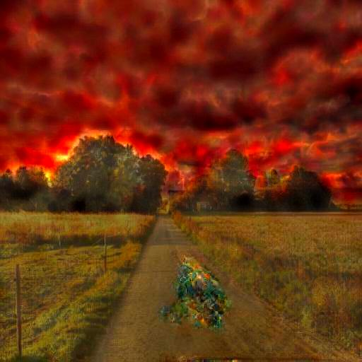

# PhotoWCT
Unofficial implementation of "A Closed-form Solution to Photorealistic Image Stylization"

 &emsp;This Project is the Unofficial implementation of "A Closed-form Solution to Photorealistic Image Stylization" which
    forks the project https://github.com/eridgd/WCT-TF. 

  &emsp;The official implementation is located in https://github.com/NVIDIA/FastPhotoStyle and this follow the TUTORIAL.md Example 3 steps. 

  &emsp;Paper Link: https://arxiv.org/abs/1802.06474 

Try Steps： 
 &emsp; 1\ download COCO dataset from http://cocodataset.org/ (this use coco 2017)
    	download vgg_normalized.t7 from web (download_vgg.sh)/ 
 &emsp; 2\ This step may not be necessary if you not want to use segmentation as prior in input (with may require more times in wavelet pooling setting---use_wavelet_pooling = True in WCTModel construction), details can be seen in ""
    	use project https://github.com/CSAILVision/semantic-segmentation-pytorch to generate some segementations
    	for coco dataset, if you have some confusions of use weights, you can appeal to my issue comment in https://github.com/CSAILVision/semantic-segmentation-pytorch/issues/116 
    	Then you can edit dataloader in test.py to generate your own segmentations, and save them in "path/to/val2017".replace("2017", "2017_seg") or "path/to/train2017".replace("2017", "2017_seg")

 &emsp; 3\	Use merge_pics_segs/merge.py to merge pics and segmentations, save them in "path/to/val2017".replace("2017", "2017_with_label") or "path/to/train2017".replace("2017", "2017_with_label")

 The merged conclusion can seen in path/to/simple2017/style_with_label.png or path/to/simple2017/content_with_label.png  

 &emsp; 4\ Train model:   
     <b1>python train_edit.py --relu-target relu3_1 --content-path path/to/train2017_with_label --batch-size 8 --feature-weight 1 --pixel-weight 1 --tv-weight 0.0 --learning-rate 1e-4 --max-iter 50000 --val-path path/to/val2017_with_label --checkpoint path/to/ckpt/ </b1> 
 
 &emsp; 5\ Evaluate the conclusion:  
    <b1>python stylize.py --input-checkpoint C:\Coding\Python\PhotoWCT\ckpt\model.ckpt-4601 --relu-targets relu3_1 --alpha 0.8 --style-path path/to/simple2017/style_with_label.png --content-path path/to/simple2017/content_with_label.png --out-path C:\Coding\Python\WCT_tf_final\output --passes 1/ </b1> 
    
 &emsp; 6\ Apply Haze Removal to conclusion, online in http://tools.pfchai.com/ or with the script located in https://github.com/pfchai/Haze-Removal/blob/master/HazeRemovalWidthGuided.py
/ 

More info can be seen in my chiness blog:  
&emsp;""

